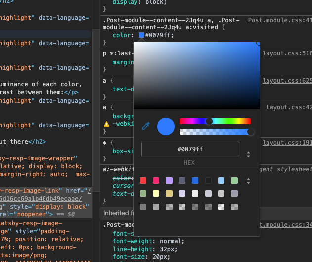
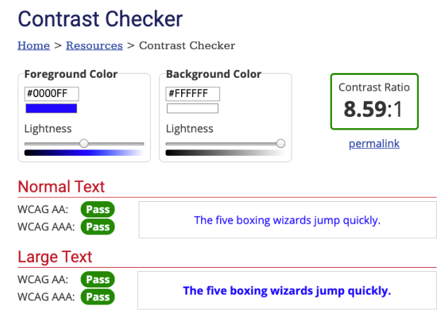

**TL;DR**: If you want your text color to change to black or white dynamically according to background color contrast, you can use the following code:

```js
function getRGB(c) {
  return parseInt(c, 16) || c
}

function getsRGB(c) {
  return getRGB(c) / 255 <= 0.03928
    ? getRGB(c) / 255 / 12.92
    : Math.pow((getRGB(c) / 255 + 0.055) / 1.055, 2.4)
}

function getLuminance(hexColor) {
  return (
    0.2126 * getsRGB(hexColor.substr(1, 2)) +
    0.7152 * getsRGB(hexColor.substr(3, 2)) +
    0.0722 * getsRGB(hexColor.substr(-2))
  )
}

function getContrast(f, b) {
  const L1 = getLuminance(f)
  const L2 = getLuminance(b)
  return (Math.max(L1, L2) + 0.05) / (Math.min(L1, L2) + 0.05)
}

function getTextColor(bgColor) {
  const whiteContrast = getContrast(bgColor, '#ffffff')
  const blackContrast = getContrast(bgColor, '#000000')

  return whiteContrast > blackContrast ? '#ffffff' : '#000000'
}
```

## See it in action

Here is a pen showing how this works. Just click the button to get a random background color and text color will change accordingly.

https://codepen.io/wunnle/pen/vYOVbqm

## How this could be useful?

On a project I'm working on, there is a page customized with brand colors of our customers. A component is using primary brand color as background color and there is a text on top of it. The problem is setting a good text color is *impossible* because whatever I pick it might not have enough contrast with background. So I had to find a way to change it according to background instead.


## Math behind it

To calculate contrast between two colors we'll use the following contrast ratio formula, defined by [WCAG guidelines](https://www.w3.org/WAI/GL/wiki/Contrast_ratio): 

```
(L1 + 0.05) / (L2 + 0.05)
```

Here L1 and L2 are *relative luminance* values of our two (foreground and background) colors. [Relative luminance](https://en.wikipedia.org/wiki/Relative_luminance) measure of how bright a color is perceived to human eye[^1] and it has a formula of:

```
Y = 0.2126R + 0.7152G + 0.0722B
```


Where R, G, B are sRGB components of a color. So to get sRGB components of a hex color we need some helper functions.

```js
function getRGB(c) {
  return parseInt(c, 16) || c
}

function getsRGB(c) {
  return getRGB(c) / 255 <= 0.03928
    ? getRGB(c) / 255 / 12.92
    : Math.pow((getRGB(c) / 255 + 0.055) / 1.055, 2.4)
}

function getLuminance(hexColor) {
  return (
    0.2126 * getsRGB(hexColor.substr(1, 2)) +
    0.7152 * getsRGB(hexColor.substr(3, 2)) +
    0.0722 * getsRGB(hexColor.substr(-2))
  )
}
```

Using relative luminance of each color, we can get the contrast between them:

```js
function getContrast(f, b) {
  const L1 = getLuminance(f)
  const L2 = getLuminance(b)
  return (Math.max(L1, L2) + 0.05) / (Math.min(L1, L2) + 0.05)
}
```

Finally, we can calculate two sets of contrast - between our color and black or white - to determine which combination is more visible.

```js
function getTextColor(bgColor) {
  const whiteContrast = getContrast(bgColor, '#ffffff')
  const blackContrast = getContrast(bgColor, '#000000')

  return whiteContrast > blackContrast ? '#ffffff' : '#000000'
}
```

## More examples out there

### Google Chrome



Chrome DevTools is using this method to get the contrast ratio between color of any DOM element and it's background. Also it rates the contrast according to [WCAG-defined levels](https://www.w3.org/WAI/WCAG21/Understanding/contrast-minimum.html).

### WebAIM



WebAIM has an [online contrast checker](https://webaim.org/resources/contrastchecker/) show contrast between two colors and WCAG levels.


[^1]: To our eyes, green color seem brightest and blue seem the least bright.
